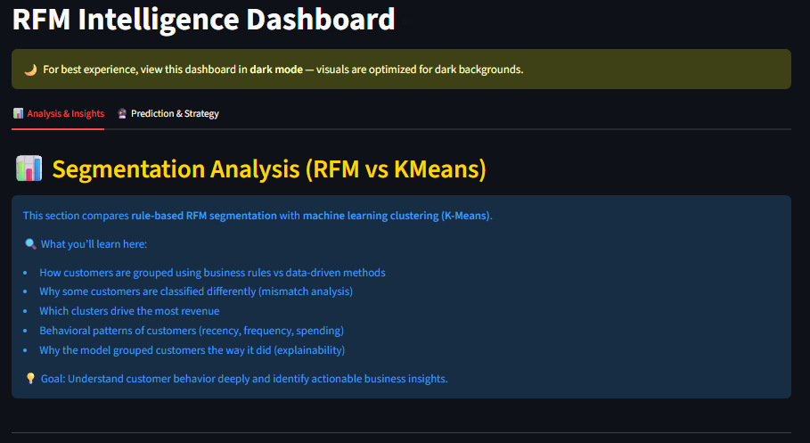
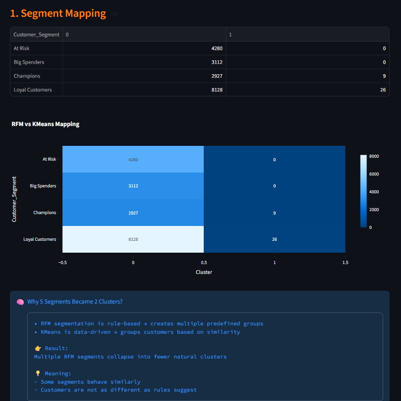
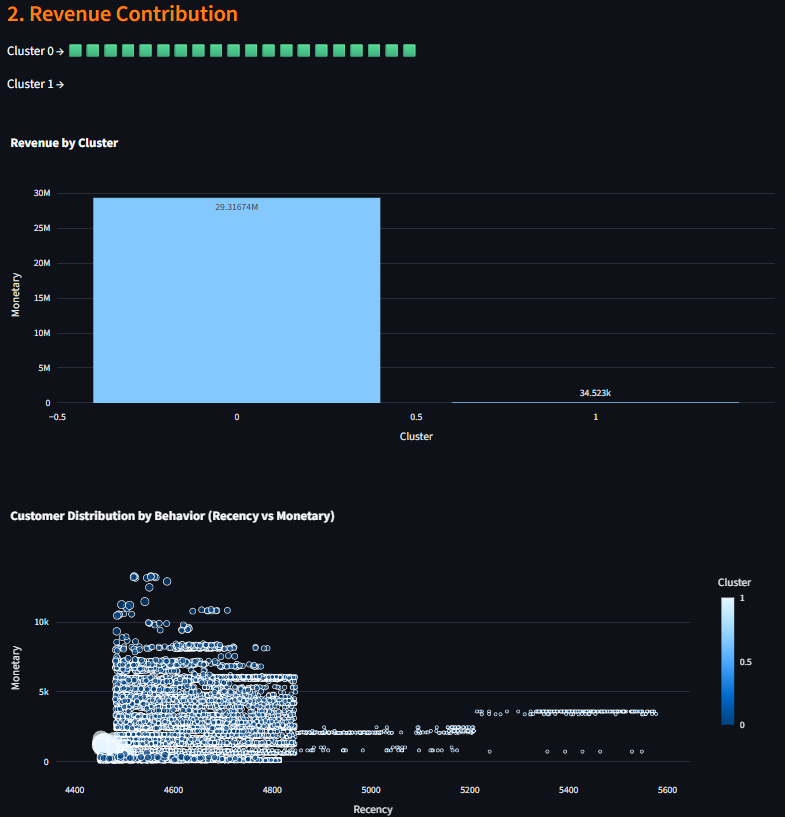
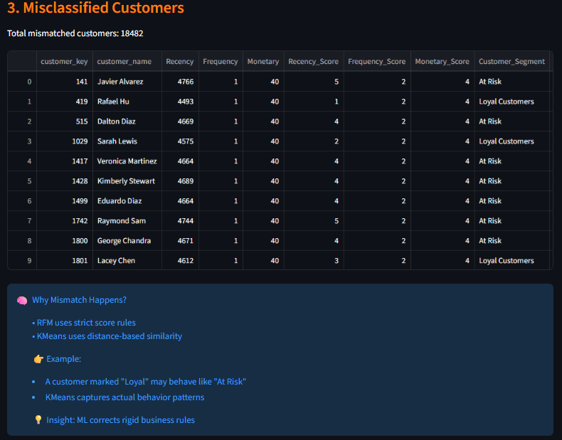
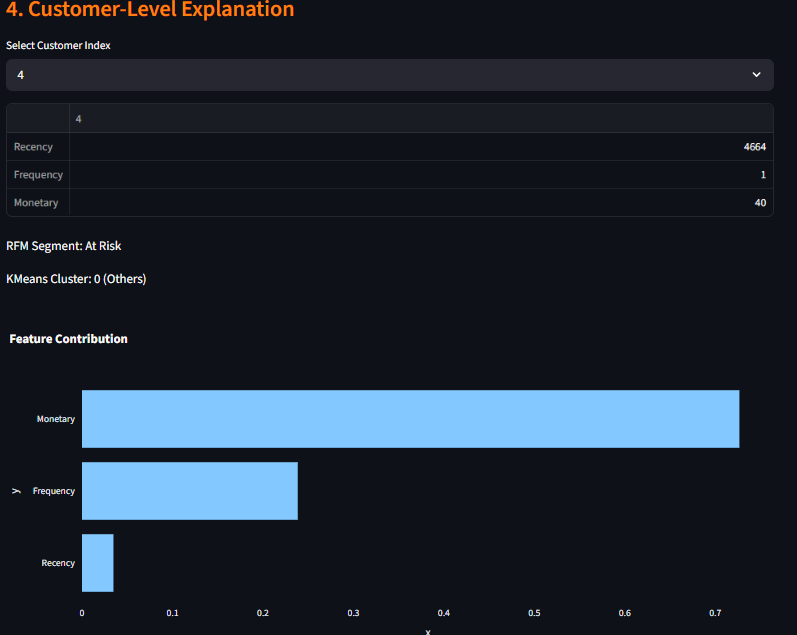
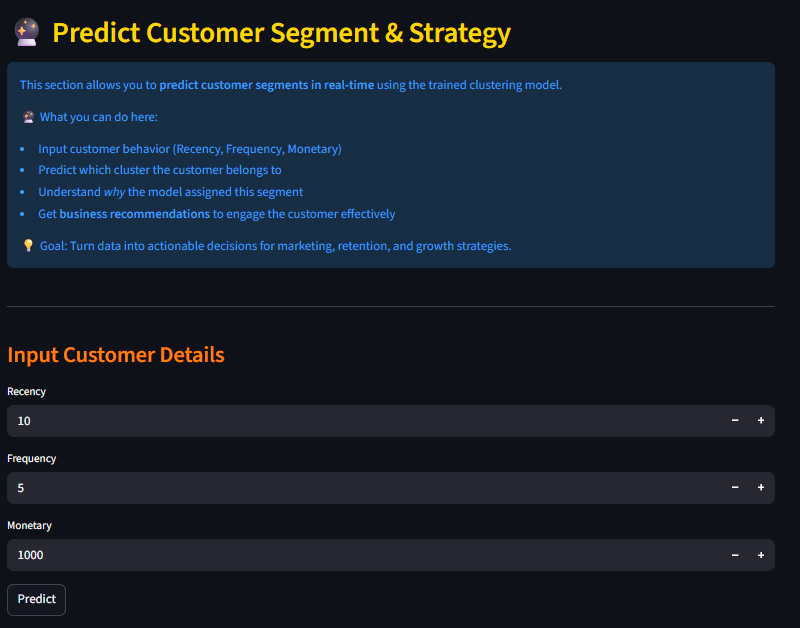
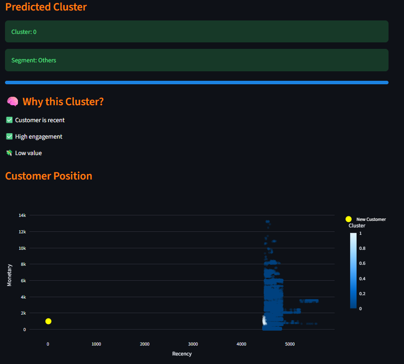
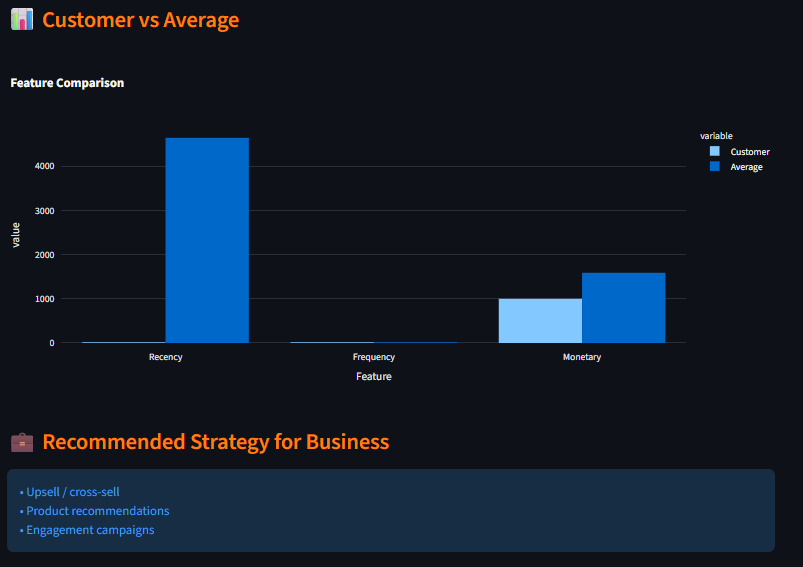

# 📊 RFM Intelligence Dashboard

## 🚀 Live App

👉 https://tushir-ashish93-rfm.streamlit.app/

------------------------------------------------------------------------

## 🌙 Best Viewing Experience

⚠️ This dashboard is optimized for **dark mode** to enhance: - Visual
clarity\
- Contrast\
- Insight interpretation

👉 Switch to dark mode for the best experience.

------------------------------------------------------------------------

## 📌 Project Overview

This project builds an **End-to-End RFM intelligence system**
combining:

-   📊 RFM Analysis (Recency, Frequency, Monetary)
-   🤖 K-Means Clustering (Machine Learning)
-   🧠 SHAP-like Explainability
-   📈 Interactive Dashboard (Streamlit + Plotly)

👉 It bridges **business rules + data science** to uncover deeper
customer insights.

------------------------------------------------------------------------

## 🧠 Problem Statement

Traditional segmentation (RFM) is: - Rule-based\
- Rigid\
- May miss behavioral overlap

👉 This project compares:

-   Rule-based segmentation\
-   Data-driven clustering

to uncover **real customer behavior patterns**.

------------------------------------------------------------------------

## ⚙️ Tech Stack

-   Python\
-   Streamlit\
-   Scikit-learn\
-   Plotly\
-   Pandas / NumPy

------------------------------------------------------------------------

# 📊 Dashboard Walkthrough

## 🏠 Main Dashboard

## 🔀 Segment Mapping

## 💰 Revenue Contribution

## ⚠️ Misclassified Customers

## 🧠 Customer Explanation

## 🔮 Prediction Engine

## 🎯 Prediction Output

## 📊 Customer vs Average

------------------------------------------------------------------------

# 🧠 Key Insights

-   RFM created 5 segments, ML found 2 clusters\
-   Overlapping behavior exists\
-   ML simplifies segmentation

------------------------------------------------------------------------

# 💼 Business Impact

-   Identify VIP customers\
-   Detect at-risk customers\
-   Improve targeting

------------------------------------------------------------------------

# ▶️ Run Locally

pip install -r requirements.txt\
streamlit run app.py

------------------------------------------------------------------------

# 👤 Author

- Ashish Tushir
- tushirgetsmail@gmail.com
